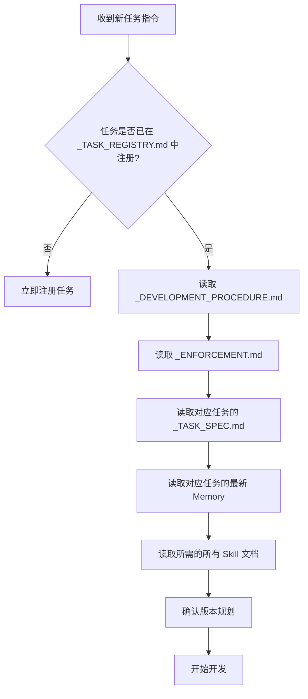

# Codex / Agent 启动检查流程

> **本文档定义了 Codex（或任何 AI Agent）在接手一个开发任务时必须执行的自检流程。**
> 每次新任务开始时，必须按此流程操作。跳过一个环节 = 触发 L3 违规。

---

## 阶段 0：启动自检（必须优先执行）



### 启动自检 Checklist

```markdown
- [ ] Step 1: 确认任务在 _TASK_REGISTRY.md 中已注册（如否 → 立即注册）
- [ ] Step 2: 读取 _DEVELOPMENT_PROCEDURE.md（必须完整读一遍）
- [ ] Step 3: 读取 _ENFORCEMENT.md（必须完整读一遍）
- [ ] Step 4: 读取 _TASK_SPEC.md（理解任务目标和版本规划）
- [ ] Step 5: 读取 memory/task-{name}/ 下最新的一份 memory 文件
- [ ] Step 6: 读取 tasks/task-{name}/ 下所有现有版本的 _VERSION_SPEC.md
- [ ] Step 7: 读取 _TASK_SPEC.md 中声明的每个 Skill 的 SKILL.md
- [ ] Step 8: 确认当前要开发的版本目录已创建（如否 → 创建）
- [ ] Step 9: 确认当前版本的 _VERSION_SPEC.md 已创建（如否 → 创建）
```

---

## 阶段 1：开发过程中

### 每次工具调用前

1. 确认当前文件属于哪个任务、哪个版本
2. 确认文件被放入正确的子目录（src/config/lib/requirements）
3. 如果是模型文件，放入 models/ 而不是版本目录
4. 如果是跨版本公共文件，放入 _common/

### 每次产生可复用结果

1. 如果是可复用的开发能力 → 写入 skills/
2. 如果是本次 session 的关键信息 → 更新 memory/
3. 如果是可共享的资源 → 放入 shared/

---

## 阶段 2：开发完成时

```markdown
- [ ] 更新 _VERSION_SPEC.md（记录本次变更、遇到的问题、解决方案）
- [ ] 更新 _TASK_SPEC.md 中的版本状态
- [ ] 更新 _TASK_REGISTRY.md 中的任务/版本状态
- [ ] 写入 memory/task-{name}/memory-{YYYYMMDD}.md
- [ ] 运行 scripts/enforce_check.py（如有）验证合规性
- [ ] 提交代码时遵循 Angular Commit 规范
```

---

## 3. 违规自检

如果在开发过程中发现**之前**的工作没有遵循本流程（例如发现了没有 _TASK_SPEC.md 的任务、没有 _VERSION_SPEC.md 的版本）：

1. **立即停止当前工作**
2. 识别违规等级
3. 在 memory/ 中记录违规
4. 补充缺失的文档（追认/补登）
5. 触发 L2 处罚：重新阅读 _DEVELOPMENT_PROCEDURE.md
6. 恢复工作

---

> **最后更新**: 2026-06-18
> **版本**: v1.0.0

---

## 阶段 1.5：实时合规守护（增量检查）

**每次写入新文件后，必须执行以下增量检查：**

1. 确认文件放入正确的子目录（src/config/lib/requirements）
2. 如果是模型文件 → 放入 models/，不是版本目录
3. 如果是跨版本公共文件 → 放入 _common/
4. 检查 _VERSION_SPEC.md 中的文件清单是否需要更新
5. 如果产出可复用能力 → 写入 skills/

### 自动修复

如果 enforce_check.py 检测到可修复的违规（如缺少子目录、缺少 _VERSION_SPEC.md），
且 scripts/auto_heal.py 存在，则自动执行修复：

```
# 等效逻辑
python dev-management-system/scripts/enforce_check.py --pass-n 3 --heal
```

- pass@3: 连续 3 次检查均通过才确认合规
- auto-heal: 检测到违规后自动创建缺失目录/文档，然后重试
- 无法自动修复的违规（L3：缺少核心制度文档）→ 触发原处罚流程

### Terminal 就绪切换

每次需要在终端执行命令时，必须先输出正确的 cd /d 切换指令：

```
cd /d C:\\Users\\tianl\\Documents\\Codex\\tasks\\<task-id>\\
```

严禁在未切换至任务根目录的情况下执行任何 Python 或 Git 命令。
